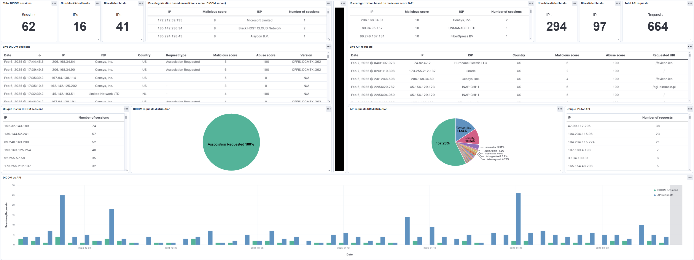
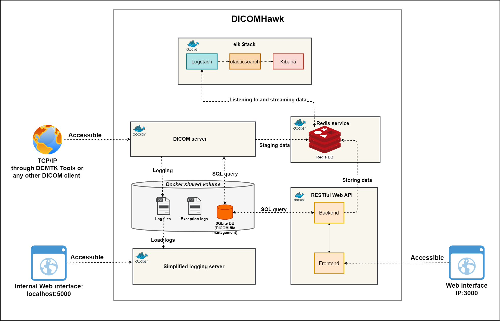

# DICOMHawk

DICOMHawk honeypot is a diception tool that allows attackers to interact with what appears to be a fully functional medical imaging system, receiving DICOM-compliant responses and real medical images.

# Key Features

- \*\*DICOMHawk enables potential attackers to perform DICOM operations on the two standard DICOM information models (STUDYROOT and PATIENTROOT) through its DICOM port.

- \*\*DICOMHawk provides an API service enabling attackers to interact with the DICOM server content. Using the API endpoints, an attacker can serach and download studies, series, patient and images data. Moreover, they can upload files to the web api server.

- \*\*DICOMHawk stores real DICOM files that are updated periodically through "The Cancer Imaging Archive (TCIA)" API and formed in a way that resembles real patient data of Danish citizens and in the Danish settings.

- \*\*DICOMHawk supports a dynamic data rotation mechanism that automatically replaces the stored DICOM files with the ones downloaded from TCIA.

- \*\*DICOMHawk employs different types of honeytoken in both the DICOM server and the web API including encapsulated PDF canary tokens, honeyURLs (Fake URLs that is seeded into the DICOM data-sets), CredentialsHoneytokens, hidden endpoints and hidden credentials in the source code.

- DICOMHawk provides automatic threat intelligence chack on each unique IP address interacts with honeypot. here we have to talk about IPQualityscore, VTOTAL.....

- \*\*An optional Blackhole service is integrated to DICOMHawk blocking traffic on kernel level for the known mass-scanner services

- \*\*DICOMHawk uses centralized monitoring to track attackers activities. IT employs a loosely coupled Elastic Stack where Logstash only needs the honeypot's IP address to retrieve staged data from the Redis server.

-

# DICOMHawk Monitoring System

- # Background

  DICOMHawk implements a centralized security monitoring infrastructure designed to track and analyze attacker behaviors. It benefits the cybersecurity teams in healthcare and research settings by enabling them to quickly detect security incidents, analyze usage and interaction patterns to better understandd potential attacker techniques, maintaining detailed logs for forensic analysis and helping to trace the source and impact of each interaction.

  

The monitoring system includes summary metrics and detailed analysis for the received DICOM sessions and API requests, represented with multiple visualization types (numbers, tables, pie charts, timelines). It also includes malicious and abuse scoring as an immediate score on each API request or DICOM session.

monitoring system utilizes several key components:

Logstash: Collects data from Redis database integrated with the honeypot.
Elasticsearch: Indexes and stores security events.
Kibana: Visualizes the collected data.

# Usage Guide

## DICOMHawk configuration

config.py, is the configuration file for the system and located in the root directory of the project.
This file contains constants that can be modified to customize the honeypot. Most of these constants including the api keys can be overridden via environment variables, which can be passed through the docker-compose file.

Given that this project is part of a thesis and represents a minimum viable product (MVP), the current method of passing sensitive information, such as API keys, through the Docker Compose file is recognized.
It's important to note that while this method provides ease of configuration, it may not be the most secure. Addressing this security aspect by using Docker Secrets, Encrypted Configuration Files ... .

To customize the honeypot setup, you can pass environment variables directly through your docker-compose.yml file as shown in this example:

```yaml
services:
  dicom_server:
    environment:
      - PROD=yes
      - FLASK_ACTIVATED=yes
      - BLOCK_SCANNERS=no
      - INTEGRITY_CHECK=yes
      - TCIA_ACTIVATED=yes
      - IP_QUALITY_SCORE_API_KEY=YourIPQualityScoreApiKey
      - VIRUS_TOTAL_API_KEY=YourVirusTotalApiKey
```

## Key Configurable Parameters in `config.py`

The main configurable parameters available in the `config.py` file, along with their possible values are:

### General Configuration

- **PROD**: Boolean (`yes` or `no`) to specify the environment mode. Setting this to `yes` configures the system for production use with corresponding production settings.

### TCIA Service Configuration

- **TCIA_USER_NAME**: Username for TCIA API authentication.
- **TCIA_PASSWORD**: Password for TCIA API authentication.
- **TCIA_ACTIVATED**: Boolean (`True` or `False`) to activate or deactivate TCIA service interaction.
- **TCIA_PERIOD_UNIT**: Unit of time (`day`, `week`, `month`) for updating DICOM files.
- **TCIA_PERIOD**: Frequency of updates, specified numerically.
- **MODALITIES**: List of modalities to retrieve, e.g., `["CT", "MR", "US", "DX"]`.
- **MINIMUM_TCIA_FILES_IN_SERIE**: Minimum number of files per series.
- **MAXIMUM_TCIA_FILES_IN_SERIE**: Maximum number of files per series.

### Logging Configuration

- **FLASK_ACTIVATED**: Boolean to enable (`True`) or disable (`False`) Flask server logging.

### Integrity Checks and Threat Intelligence

- **INTEGRITY_CHECK**: Boolean to enable (`True`) or disable (`False`) periodic integrity checks.
- **ABUSE_IP_API_KEY**, **IP_QUALITY_SCORE_API_KEY**, **VIRUS_TOTAL_API_KEY**: API keys for respective threat intelligence services.

### DICOM Server and Blackhole Configuration

- **DICOM_PORT**: Port number for the DICOM server.
- **DICOM_SERVER_HOST**: IP address or hostname of the DICOM server.
- **BLOCK_SCANNERS**: Boolean to block (`True`) or allow (`False`) known mass scanners.

## Deploying DICOMHawk using Docker Compose

Before deploying DICOMHawk, be sure that the required ports (104, 3000, 5000, and 6379) are not in use on your system.

**For Linux users**

```bash
netstat -tuln | grep -E '104|3000|5000|6379'
```

**For Windows users**

```bash
netstat -tuln | grep -E '104|3000|5000|6379'
```

If any of these ports are in use, you will need to free them or configure DICOMHawk to use different ports.

To deploy DICOMHawk using Docker Compose, use the following command which clone the repository, navigates to the project directory, and launches the required services. Note that cloning the repository may take a significant amount of time due to the large size of the real DICOM files from various modalities stored in it

```bash
git clone https://github.com/albab19/ThesisProject2.git && cd ./ThesisProject2 && docker-compose up -d
```

## Running DICOMHawk Locally

To run DICOMHawk locally, each service should be launched separately in its respective directory. It is crucial to ensure that a Redis service is operational on port 6379 before starting the other services, as they depend on Redis for various functionalities.

### Pre-requisites

- **Redis Service**: Ensure that Redis is running on port 6379. You can start Redis using the following command if you have Redis installed:
  ```bash
  redis-server --port 6379
  ```
  If you do not have Redis installed, you can easily run a Redis instance using Docker with the following command:

```bash
docker run -p 6379:6379 --name redis-db -d redis
```

### Starting Each Service

#### DICOM Server

- Navigate to the DICOM server directory from the project root:
  ```bash
  cd /dicom_server
  ```
- Run the DICOM server using Python:
  ```bash
  python main.py  # Use python3 main.py if your environment defaults to Python 3
  ```

#### API Service

- Navigate to the API service directory from the project root:
  ´´´bash
  cd /API

````
- Run the API using Node.js:
```bash
 node app.js
````

#### Flask Logging Server

- Navigate to the Flask logging server directory from the project root:

```bash
   cd /dicom_server
```

- Start the logging server:

```bash
   python logserver.py  # Use python3 logserver.py if your environment defaults to Python 3
```

## Running the monitoring stack

Before deploying monitoring stack, be sure that the required ports (5601, 9200, 9300) are not in use on your system. Follow the same steps to check DICOMHawk ports and free them in case they are in used or configure the monitoring stack to use different ports.

To deploy the monitoring stack, navigate to the directory and run the containing monitoring stack's Docker Compose file:

```bash
cd ManagementStack/
docker-compose up -d
```

# Usage Examples

# Deployment Architecture


